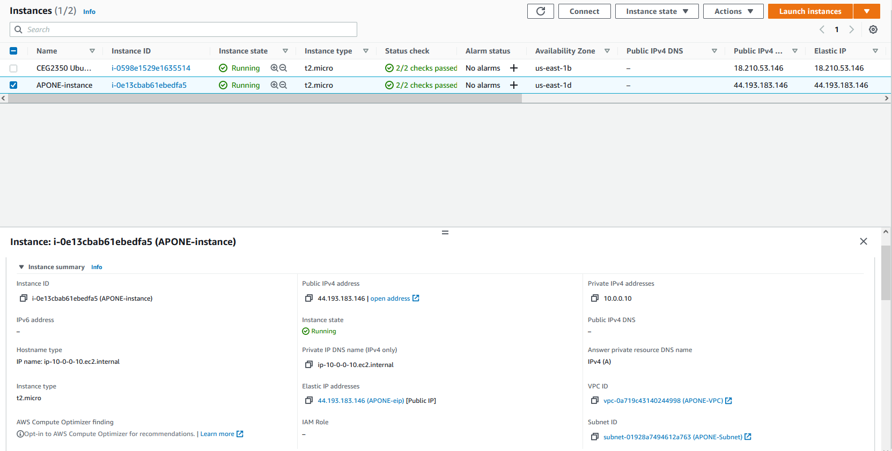

## Part 1 - Build a VPC
1. Create a VPC
   - A VPC is a virtual network on the cloud
   -  

2. Create a subnet
   - A subnet is a range of IP's within the VPC
   - 

3. Create an internet gateway
   - An intenet gateway enables the VPC to communicate with the internet
   - 

4. Create a route table
   - A route table directs network traffic in the VPC
   - 

5. Create a security group
   - A security group controls inbound and outbound traffic in the VPC
   - 

------------------------------------------------------------------

## Part 2 - EC2 instances
1. Create a new instance. Give a write up of the following information:
  - AMI selected: Amazon Linux 2 AMI (HVM) - Kernel 5.10, SSD Volume Type - ami-033b95fb8079dc481 (64-bit x86)
  - default username: ec2-user
  - Instance type: t2.micro

2. In the "Configure Instance" tab I changed the network to APONE-VPC

3. In the "Configure Instance" tab, the "Auto-assign Public IP" setting is set to "Use subnet setting(Disable)", therefore an IPv4 address will not be automatically assigned.

4. In the "Add Storage" tab I clicked "Add New Volume", I also made sure to select delete on termination.

5. In the "Add Tags" tab, I clicked "Add Tag". Under "Key" I typed "Name", under "Value" I typed "APONE-instance".

6. In the "Configure Security Group" tab, I picked "Select an existing security group", then picked "APONE-sg".

7. I clicked on "Elastic IPs" in the left-hand EC2 toolbar, then "Allocate Elastic IP address". I left the default settings, but added the tag "APONE-eip". With the new IP address selected I clicked "Actions" then "Associate Elastic IP address". Under instance I selected "APONE-instance". Under private IP address I selected "10.0.0.10".

8. 

9. Once I connected to the system, I checked the hostname with "hostname". It was "ip-10-0-0-10.ec2.internal". Then, I navigated to where the hostnames are stored and made a copy of the hosts file called "hosts.old". After, I used the command "sudo hostnamectl set-hostname APONE-AmazonLinux2". I appended "127.0.0.1 APONE-AmazonLinux2" to the end of hosts.

10. 

