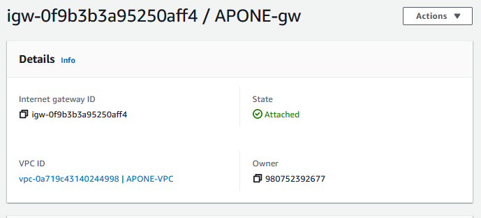

## Part 1 - Build a VPC
1. Create a VPC
   - A VPC is a virtual network on the cloud
   -  

2. Create a subnet
   - A subnet is a range of IP's within the VPC
   - 

3. Create an internet gateway
   - An intenet gateway enables the VPC to communicate with the internet
   - 

4. Create a route table
   - A route table directs network traffic in the VPC
   - 

5. Create a security group
   - A security group controls inbound and outbound traffic in the VPC
   - 

------------------------------------------------------------------

## Part 2 - EC2 instances
1. Create a new instance. Give a write up of the following information:
  - AMI selected
    - default username of the instance type selected
  - Instance type selected

2. Attach the instance to your VPC. As discussed there are different pathways to doing this. Say how you did it.

3. Determine whether a Public IPv4 address will be auto-assigned to the instance. Justify your choice to do so (or not do so)
  - NOTE - in the next few steps, you will be required to request an Elastic IP address and associate it to the instance. Factor that in to your discussion here.

4. Attach a volume to your instance. As discussed there are different pathways to doing this. Say how you did it.

5. Tag your instance with a "Name" of "YOURLASTNAME-instance". Say how you did it

6. Associate your security group, "YOURLASTNAME-sg" to your instance. Say how you did it.

7. Reserve an Elastic IP address. Tag it with "YOURLASTNAME-EIP". Associate the Elastic IP with your instance. Say how you did it.

8. Create a screenshot your instance details and add it to your project write up. Example below: sample instance details

9. ssh in to your instance. Change the hostname to "YOURLASTNAME-AMI" where AMI is some version of the AMI you chose. Say how you did it.
  - It is wise to copy config files you are about to change to filename.old For /etc/hostname, for example, I would first copy the current hostname file to /etc/hostname.old
  - You should not change permissions on any files you are modifying. They are system config files. You may need to access them with adminisrative privileges.
  - Here is a helpful resource: https://www.tecmint.com/set-hostname-permanently-in-linux/ I did not modify /etc/hosts on mine - do so or not as you wish.

10. Create a screenshot your ssh connection to your instance and add it to your project write up - make sure it shows your new hostname.

